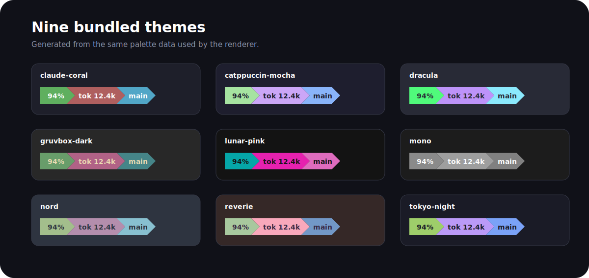

# Coralline Codex

[](https://github.com/waynehacking8/coralline-codex/actions/workflows/ci.yml)
[](https://github.com/waynehacking8/coralline-codex/releases)
[](LICENSE)


Coralline Codex is a polished status experience for the OpenAI Codex CLI. It
combines Codex's native footer with an isolated terminal companion so the
information people check most—plan limits, reset time, projected exhaustion,
and active-session tokens—stays visible while they work.

This is an independent Codex port of
[Nanako0129/coralline](https://github.com/Nanako0129/coralline), not the
upstream Claude Code project. Attribution and port details are in
[NOTICE.md](NOTICE.md).

[繁體中文](README.zh-TW.md) · [Integration details](docs/INTEGRATION.md) ·
[Quality gates](docs/QUALITY-GATES.md)

## What it adds

- Exact plan remaining percentage and local reset time from Codex's authenticated
  app-server.
- Live session input, output, and total token counts from the active local rollout.
- A conservative burn projection with `warming`, `idle`, `reset-safe`, and
  time-to-exhaustion states. It needs at least five minutes of history before it
  makes a projection.
- A responsive Powerlevel10k-style companion with directory, detailed Git state,
  model/profile, elapsed time, clock, and optional Node/Python environments.
- Nine generated native Codex themes, three companion styles, an ASCII fallback,
  and a guided visual setup.
- Optional managed shell integration, so ordinary commands such as
  `codex --yolo` launch through Coralline automatically.



## Platform support

| Platform | Support tier | Experience |
|---|---|---|
| Linux, Bash 4+ | Full | Native Codex footer + live isolated tmux companion |
| macOS, Homebrew Bash 4+ | Full | Native Codex footer + live isolated tmux companion |
| Windows 11 with WSL2 | Full | Same Linux companion experience inside WSL |
| Native Windows PowerShell | Native | Themed Codex footer, limits/tokens, exact `usage`, managed PowerShell hook |
| Windows Git Bash/MSYS2 | Compatible | Bash lifecycle and fallback tested; full companion requires a working tmux |

Native Windows does not show the extra Powerlevel10k companion bar because Codex
does not expose an external footer renderer there. It still gets the supported
native Codex fields and on-demand usage tracking. Use WSL2 for feature parity
with Linux and macOS.

## Install

The supported installation path is a local, reviewable checkout. The project
does not ask you to pipe a remote script into a shell.

### Linux

Install Bash 4+, Python 3.8+, Git, Codex, and tmux with your package manager,
then:

```bash
git clone https://github.com/waynehacking8/coralline-codex.git
cd coralline-codex
./install.sh --shell-hook auto
~/.local/bin/coralline-codex verify
```

Open a new shell. Normal `codex` commands now use Coralline. If
`~/.local/bin` is not on `PATH`, add it to your shell configuration for direct
`coralline-codex` commands.

### macOS

macOS ships an older Bash, so install current dependencies first:

```bash
brew install bash python tmux git
git clone https://github.com/waynehacking8/coralline-codex.git
cd coralline-codex
./install.sh --shell-hook zsh
~/.local/bin/coralline-codex verify
```

The launcher uses the Homebrew Bash found on `PATH`. The managed hook is added
to `~/.zshrc`; open a new terminal or source that file once.

### Windows 11 + WSL2

Clone and run the Linux instructions inside WSL. Install `tmux`, Python 3, Git,
and Bash in that distribution. This is the full Windows experience.

### Native Windows PowerShell

Install Git, Python 3.8+, and Codex, then run from PowerShell:

```powershell
git clone https://github.com/waynehacking8/coralline-codex.git
Set-Location coralline-codex
powershell.exe -NoProfile -ExecutionPolicy Bypass -File .\install.ps1 -ShellHook
. $PROFILE.CurrentUserAllHosts
codex --yolo
coralline-codex usage
```

The optional hook adds managed `codex` and `coralline-codex` functions to the
current-user PowerShell profile. The installer also creates
`$HOME\.local\bin\coralline-codex.cmd` without silently changing `PATH`.

Custom locations, including paths with spaces, are supported on every tier.

## Use

```bash
codex --yolo                         # when the optional shell hook is installed
coralline-codex                     # direct wrapper launch
coralline-codex --model gpt-5.6
coralline-codex --no-companion      # native footer only
coralline-codex usage               # refresh and print exact account usage
coralline-codex preview             # preview all themes (Bash companion tier)
```

Arguments are passed as an array without string evaluation. Non-interactive
Codex subcommands such as `exec` skip tmux automatically. Coralline does not
change the meaning or security implications of `--yolo`; it simply forwards the
flag.

To bypass an installed hook for one command:

```bash
CORALLINE_CODEX_DISABLE=1 codex --version
```

```powershell
$env:CORALLINE_CODEX_DISABLE = '1'; codex --version; Remove-Item Env:CORALLINE_CODEX_DISABLE
```

## Configure

The Bash companion tier has a visual wizard:

```bash
coralline-codex configure
```

Or make focused changes:

```bash
coralline-codex configure --theme catppuccin-mocha --style pill
coralline-codex configure --node on --python on --runtime-probe off
coralline-codex configure --segments "limits burn tokens dir git elapsed clock"
coralline-codex configure --ascii on --usage-refresh 60
coralline-codex configure --preview
```

Native PowerShell supports theme/native-footer configuration:

```powershell
coralline-codex configure --theme nord
coralline-codex configure --show
```

Runtime probes are off by default. Node checks `.nvmrc` and `.node-version`;
Python checks virtualenv, conda, and `.python-version`. Missing data hides only
that segment. The renderer progressively compacts limits and tokens down to a
30-column terminal instead of dropping the critical values first.

## How usage tracking works

The background watcher asks the authenticated Codex app-server for account
limits, then writes atomic mode-0600 caches under
`$CODEX_HOME/coralline-codex-cache/`. Rendering is local and network-free.
Transient failures preserve the last valid values and visibly mark them stale.

Projection history contains only timestamps and percentage-used samples. It is
stored mode 0600, separated by reset window, pruned after 14 days, and never
uploaded by Coralline. A projection is explicitly labeled as warming up until a
sufficient baseline exists; it is an estimate, not a promise from OpenAI.

The native Codex footer remains authoritative for live context percentage,
model, and reasoning effort. If `/model` changes the model during a session, the
native footer updates while the optional companion model label remains the
launch-time value.

## Update and uninstall

From a checkout:

```bash
git pull --ff-only
./install.sh --update --shell-hook auto
coralline-codex verify
```

On native Windows, pull the checkout and run `./install.ps1 -Update`; an existing
managed profile hook is preserved. Updates print the version transition and
release highlights.

```bash
coralline-codex uninstall
```

The installed runtime, generated themes, companion config, and managed hook are
removed only within their recorded scope. Material files are moved to a
timestamped recoverable backup. Coralline never edits Codex's `config.toml`.

## Verify and contribute

```bash
coralline-codex verify
./test/run.sh
python3 tools/render_assets.py --check
```

CI exercises Linux, macOS, native Windows PowerShell, and Windows Git Bash. See
[CONTRIBUTING.md](CONTRIBUTING.md), [SECURITY.md](SECURITY.md), and the complete
[quality gates](docs/QUALITY-GATES.md) before sharing changes.

## License

MIT. See [LICENSE](LICENSE) and [NOTICE.md](NOTICE.md).
