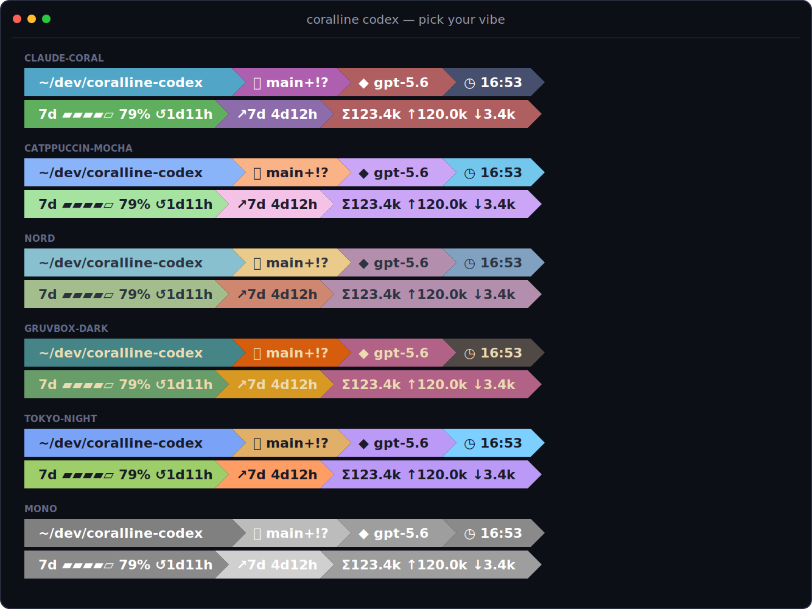

# Coralline Codex

> 給 OpenAI Codex CLI 用、向
> [Powerlevel10k](https://github.com/romkatv/powerlevel10k) 致敬的狀態體驗；
> 結合 Codex 原生 footer 與即時 terminal companion，持續顯示用量限額、
> 消耗預測及 session token。

[English README](./README.md)



## 效果

```text
7d ▰▰▰▰▱ 79% ↺1d11h  ↗7d 4d12h  Σ123.4k ↑120.0k ↓3.4k  ~/dev/coralline-codex   main+!?  ◆ gpt-5.6  ⧖ 47m  ◷ 16:53 
```

| 區段 | 顯示內容 |
|---|---|
| `limits` | 精確方案剩餘比例、五格量表、本地重設倒數及過期資料警告 |
| `burn` | 保守的耗盡時間預測，包含暖機、閒置、可撐過重設及追蹤狀態 |
| `tokens` | 目前 session 的輸入、輸出及總 token 數 |
| `dir` | 目前目錄，過長路徑會自動縮短 |
| `project` | repo 名稱；不在 Git repo 時隱藏 |
| `git` | 分支、已暫存 `+`、已修改 `!`、未追蹤 `?`、領先 `↑` 及落後 `↓` 狀態 |
| `node` / `python` | 固定版本或目前 runtime 環境；需手動開啟，偵測不到時隱藏 |
| `model` / `profile` | 啟動時可取得的 Codex model 與 profile |
| `elapsed` | session 經過時間 |
| `clock` | 本地 24 小時制時鐘 |

Codex 原生 footer 仍是即時 model、推理強度、剩餘 context、limits 與 used
tokens 的權威來源。Companion 補上原生 footer 沒有的欄位，並可逐步壓縮至
30 欄寬的 terminal；量表與預測會依緊急程度變色。

Coralline Codex 內含九款 Codex 原生主題、四種 companion 樣式、ASCII
fallback、即時預覽設定精靈，以及可選、可逆的 shell hook，讓平常的
`codex --yolo` 自動套用 Coralline。

本專案衍生自 [Nanako0129/coralline](https://github.com/Nanako0129/coralline)，
但不是上游 Claude Code 版本。授權與移植範圍請見 [NOTICE.md](./NOTICE.md)。

## 平台支援

| 平台 | 等級 | 體驗 |
|---|---|---|
| Linux、Bash 4+ | 完整 | Codex 原生 footer + 隔離的 tmux companion |
| macOS、Homebrew Bash 4+ | 完整 | Codex 原生 footer + 隔離的 tmux companion |
| Windows 11 + WSL2 | 完整 | 在 WSL 內提供與 Linux 相同的完整功能 |
| Windows 原生 PowerShell | 原生 | 主題化 Codex footer、limits/tokens、精確 `usage`、PowerShell hook |
| Windows Git Bash/MSYS2 | 相容 | 已測試 Bash lifecycle 與 fallback；完整 companion 需要可用的 tmux |

Codex 在 Windows 原生環境沒有公開的外部 footer renderer，因此 PowerShell
版本無法加上額外的 Powerlevel10k companion；這不是偽裝成完整支援。需要完整
功能時請使用 WSL2。

## Linux 安裝

先用套件管理器安裝 Bash 4+、Python 3.8+、Git、Codex 與 tmux，再執行：

```bash
git clone https://github.com/waynehacking8/coralline-codex.git
cd coralline-codex
./install.sh --shell-hook auto
~/.local/bin/coralline-codex verify
```

重新開啟 shell 後，一般 `codex` 指令會自動經過 Coralline。如果
`~/.local/bin` 不在 `PATH`，請加入 shell 設定，才能直接執行
`coralline-codex` 指令。

## macOS 安裝

macOS 內建 Bash 版本較舊，先安裝目前版本：

```bash
brew install bash python tmux git
git clone https://github.com/waynehacking8/coralline-codex.git
cd coralline-codex
./install.sh --shell-hook zsh
~/.local/bin/coralline-codex verify
```

管理式 hook 會寫入 `~/.zshrc` 的清楚標記區塊；重新開啟 terminal，或手動
source 一次該檔案即可。

## Windows 11 + WSL2

在 WSL distribution 內 clone，並依照上述 Linux 步驟安裝 Bash、Python 3、
Git 與 tmux。這是 Windows 的完整功能路徑。

## Windows 原生 PowerShell

先安裝 Git、Python 3.8+ 與 Codex，然後在 PowerShell 執行：

```powershell
git clone https://github.com/waynehacking8/coralline-codex.git
Set-Location coralline-codex
powershell.exe -NoProfile -ExecutionPolicy Bypass -File .\install.ps1 -ShellHook
. $PROFILE.CurrentUserAllHosts
codex --yolo
coralline-codex usage
```

`-ShellHook` 會在使用者 PowerShell profile 加入受管理的 `codex` 與
`coralline-codex` function。安裝器也會建立
`$HOME\.local\bin\coralline-codex.cmd`，但不會擅自修改使用者 `PATH`。

所有平台都支援含空白的自訂 `CODEX_HOME` 與安裝路徑。正式安裝方式是可先
審查的本機 checkout；本專案不要求使用 `curl | bash`。

## 使用

```bash
codex --yolo
coralline-codex
coralline-codex --no-companion
coralline-codex usage
coralline-codex preview
```

參數以陣列直接轉交，不使用字串 eval。`exec` 等非互動 subcommand 會自動略過
tmux。Coralline 不會改變 `--yolo` 的語意或風險，只會原樣轉交該參數。

暫時繞過 hook：

```bash
CORALLINE_CODEX_DISABLE=1 codex --version
```

```powershell
$env:CORALLINE_CODEX_DISABLE = '1'; codex --version; Remove-Item Env:CORALLINE_CODEX_DISABLE
```

## 設定

Linux、macOS 與 WSL 可開啟視覺化精靈：

```bash
coralline-codex configure
```

或直接指定：

```bash
coralline-codex configure --theme tokyo-night --style powerline
coralline-codex configure --node on --python on --runtime-probe off
coralline-codex configure --segments "limits burn tokens dir git elapsed clock"
coralline-codex configure --ascii on --usage-refresh 60
coralline-codex configure --preview
```

Windows 原生 PowerShell 支援：

```powershell
coralline-codex configure --theme nord
coralline-codex configure --show
```

renderer 會依寬度逐步縮短 limits 與 tokens，即使終端只有 30 欄，也會優先
保留最重要的數值。可選 runtime 資料不存在時只隱藏該區段，不會填入猜測值。

## 用量資料與隱私

背景 watcher 透過已登入的 Codex app-server 取得方案限制，再以 atomic write
寫入 `$CODEX_HOME/coralline-codex-cache/` 下權限為 0600 的快取。renderer
只讀本機快取，不會連線；暫時查詢失敗時會保留最後一次有效數值並標記 stale。

預測歷史只含時間戳與已用百分比，依 reset window 分開、14 天後清除，而且
Coralline 不會上傳這份資料。預測只是估算，不代表 OpenAI 保證。

Codex 原生 footer 仍是 context 百分比、即時模型與推理強度的權威來源。Codex
目前沒有 Claude Code 式外部 `statusLine`／`subagentStatusLine` renderer，因此
這些原生欄位無法套用 companion 的彩色區段背景。

## 更新與解除安裝

```bash
git pull --ff-only
./install.sh --update --shell-hook auto
coralline-codex verify
```

Windows 原生環境請 pull 後執行 `./install.ps1 -Update`。更新會保留既有管理式
hook，並顯示版本變更與 release 重點。

```bash
coralline-codex uninstall
```

安裝內容、產生的主題、companion 設定與管理式 hook 只會在記錄的範圍內移除；
重要檔案會先移到有時間戳的可復原備份。Coralline 不會修改 Codex 的
`config.toml`。

## 驗證

```bash
coralline-codex verify
./test/run.sh
python3 tools/render_assets.py --check
```

CI 會測試 Linux、macOS、Windows 原生 PowerShell 與 Windows Git Bash。更多
資訊請見 [CONTRIBUTING.md](CONTRIBUTING.md)、[SECURITY.md](SECURITY.md) 與
[品質門檻](docs/QUALITY-GATES.md)。
